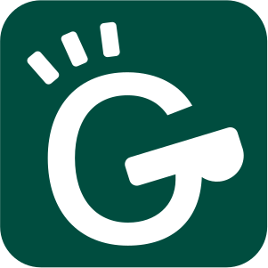

# GAM Coach <a href="https://poloclub.github.io/gam-coach/"></img></a>

An interactive tool to help everyday users discover actionable strategies to obtain desired AI decisions.

[](https://github.com/poloclub/gam-coach/actions)
[](https://github.com/poloclub/gam-coach/blob/master/LICENSE)
[](https://poloclub.github.io/gam-coach/docs/gamcoach)

[](https://pypi.python.org/pypi/gamcoach)
[](https://arxiv.org/abs/2302.14165)
<!-- [](https://doi.org/10.1145/3491101.3519653) -->

<table>
  <tr>
    <td colspan="4"><a href="https://poloclub.github.io/gam-coach"></a></td>
  </tr>
  <tr></tr>
  <tr>
    <td><a href="https://poloclub.github.io/timbertrek">🚀 Live Demo</a></td>
    <td><a href="https://youtu.be/ubacP34H9XE">📺 Demo Video</a></td>
    <!-- <td><a href="https://youtu.be/l1mr9z1TuAk">👨🏻‍🏫 Conference Talk</a></td> -->
    <td><a href="https://arxiv.org/abs/2302.14165">📖 Research Paper</a></td>
  </tr>
</table>

## What is GAM Coach?

GAM Coach is an interactive tool that helps *everyday users* **understand** and **alter** machine learning models' decisions.
It shows users diverse ways to change their input data so that they can get a different output from the model, and it allows users to customize these suggestions through a few clicks!
For example, if a user wants to get approved for a loan, GAM Coach may suggest they increase their credit score.
If the user finds it difficult to increase their credit score, GAM Coach will search for alternative strategies, such as lowering the loan amount.

## Live Demo

For a live demo, visit: <https://poloclub.github.io/gam-coach/>

## Running Locally

Clone or download this repository:

```bash
git clone git@github.com:poloclub/gam-coach.git

# use --depth if you don't want to download the whole commit history
git clone --depth 1 git@github.com:poloclub/gam-coach.git
```

Install the dependencies:

```bash
cd gamcoach-ui
npm install
```

Then run GAM Coach:

```bash
npm run dev
```

Navigate to [localhost:5005](https://localhost:5005). You should see GAM Coach running in your browser :)

## Credits

GAM Coach is a result of a collaboration between ML and visualization researchers from Georgia Tech and Microsoft Research.
GAM Coach is created by <a href='https://zijie.wang/' target='_blank'>Jay Wang</a>, <a href='https://www.jennwv.com' target='_blank'>Jenn Wortman Vaughan</a>, <a href='https://www.microsoft.com/en-us/research/people/rcaruana/' target='_blank'>Rich Caruana</a>, and <a href='' target='_blank'>Polo Chau</a>.

## Citation

To learn more about GAM Coach, please read our [research paper](https://arxiv.org/abs/2302.14165) (published at [CHI 2023](https://chi2023.acm.org)).

```bibTeX
@article{wangGAMCoachInteractive2023,
  title = {{{GAM Coach}}: {{Towards Interactive}} and {{User-centered Algorithmic Recourse}}},
  author = {Wang, Zijie J. and Vaughan, Jennifer Wortman and Caruana, Rich and Chau, Duen Horng},
  year = {2023},
  doi = {10.1145/3544548.3580816}
  journal = {arXiv:2302.14165},
  url = {https://arxiv.org/abs/2302.14165},
  archiveprefix = {arXiv}
}
```

## License

The software is available under the [MIT License](https://github.com/poloclub/gamcoach/blob/master/LICENSE).

## Contact

If you have any questions, feel free to [open an issue](https://github.com/poloclub/gamcoach/issues/new) or contact [Jay Wang](https://zijie.wang).
